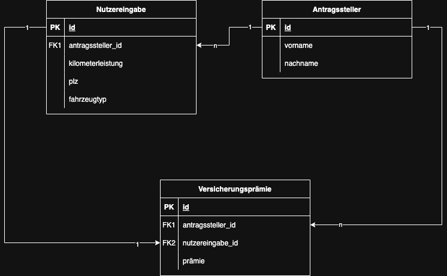
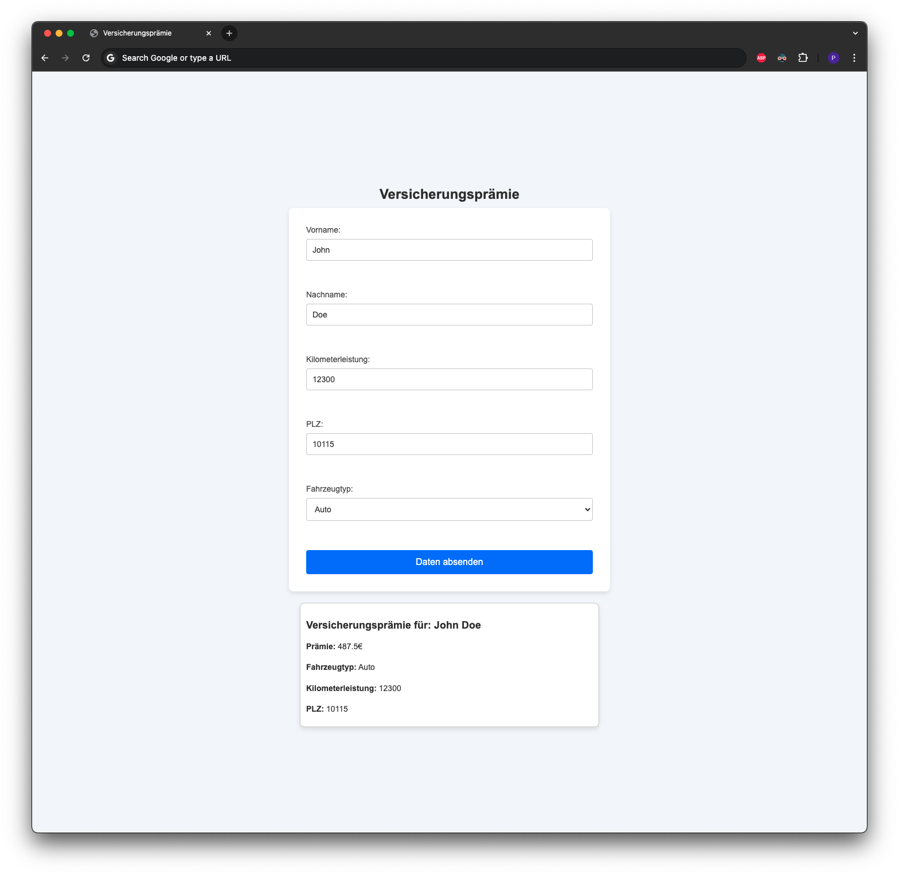

# Project Overview

This coding challenge is a full-stack application built with **Java Spring Boot** (backend) and **vanilla HTML/CSS/JavaScript** (frontend). The application allows users to submit personal data through a form, calculates a custom insurance premium based on the input, and displays the result along with the submitted information. The project demonstrates integration between a RESTful backend and a lightweight frontend, as well as interaction with a **PostgreSQL** database.


# Coding Challenge Frontend SETUP

## PREREQUISITES (Backend & Database Setup)
1. Start by setting up the database & backend first -> instructions inside: /codingchallenge/sql_backend_setup/SQL_and_Backend_setup.MD
2. Start database & backend

### Option 1: VSCode + Live Server Plugin (recommended) 
1. Open Frontend in VSCode
2. Install "Live Server" Plugin by Ritwick Dey - Link https://marketplace.visualstudio.com/items/?itemName=ritwickdey.LiveServerStart
3. Right click index.html inside vscode -> and press "Open with Live Server" to start it

### Option 2: Visit Website Through Absolute Path
1. Open project in an IDE of your liking and copy the absolute path or copy absolute path of the index.html file from projects directory
2. Paste Absolute path into your browser and visit the page

### Info
Lombok did not work in this project directory - did not investigate further for the scope of this challenge.
Defaulted back to setting getters & setters manually and building Objects instead of using the Builder api.
Lombok might work on your machine

# Workflow
1. User vists website
2. User enters data
3. User submits data by pressing the button
4. User finds his premium underneath the form together with the submitted data 

## API Overview

### `POST /premium/save/nutzereingabe`

Accepts user input from the frontend, saves it to the database, calculates the insurance premium, and returns the premium amount.

#### Request Body (JSON)

```json
{
  "firstname": "Max",
  "lastname": "Mustermann",
  "plz": "12345",
  "fahrzeugtyp": "Auto",
  "kilometerleistung": 15000
}
```
Example Response Body
```
450.0
```

## Database Diagram



## UI 



## Future Quality Improvements
Certain quality standards have not been introduced into this challenge due to the scope of this coding challenge like:
- Validating user inputs: no text inside "Kilometerleistung", only accepting numbers
- Responsive design
- translations 
- Frontend and Backend Input validator for fixed fields like PLZ
- Database varchar into a fixed data type number length since PLZ can only have 5 numbers

---

## Questions?

If you have any questions or need assistance running the project, feel free to contact me at:  
📧 **qs.chitanta@gmail.com**
